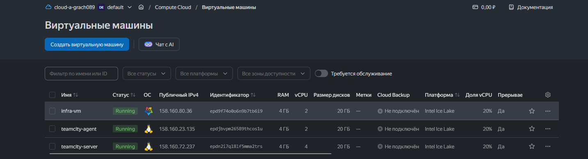
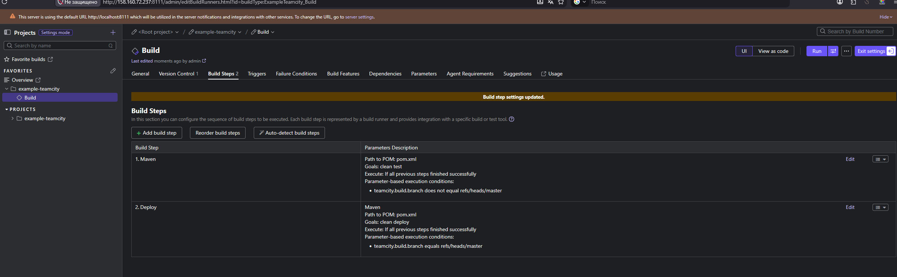
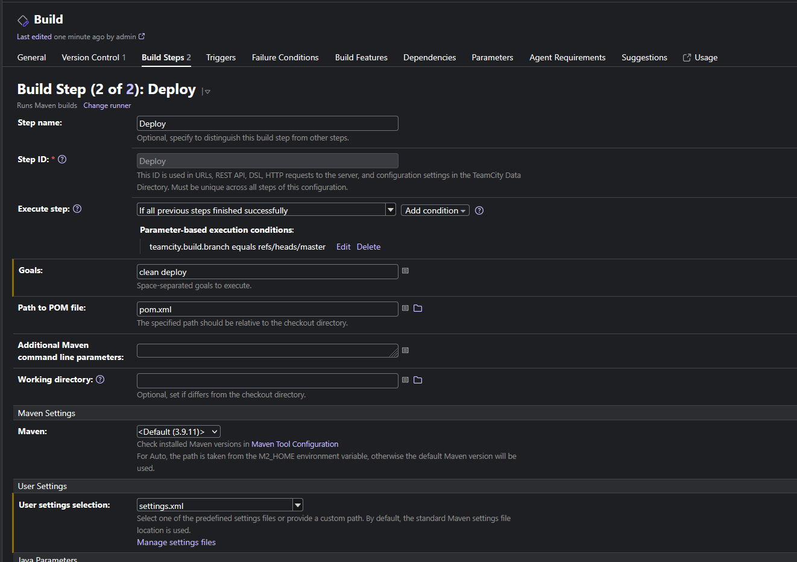
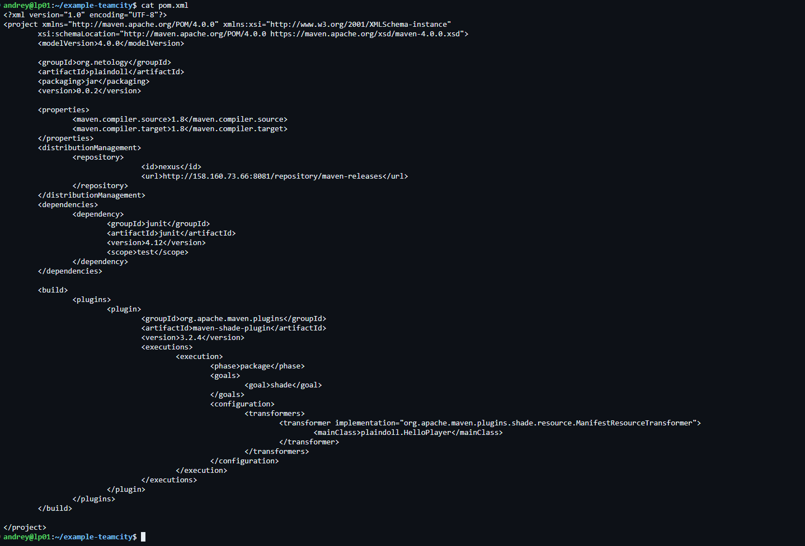
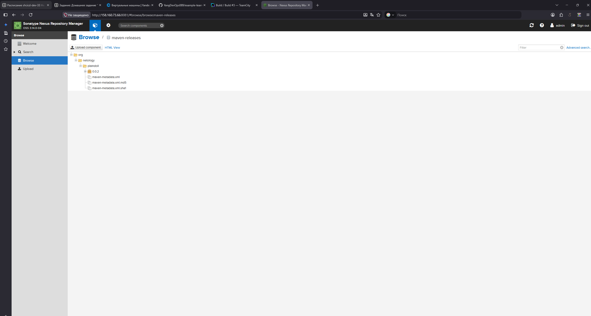
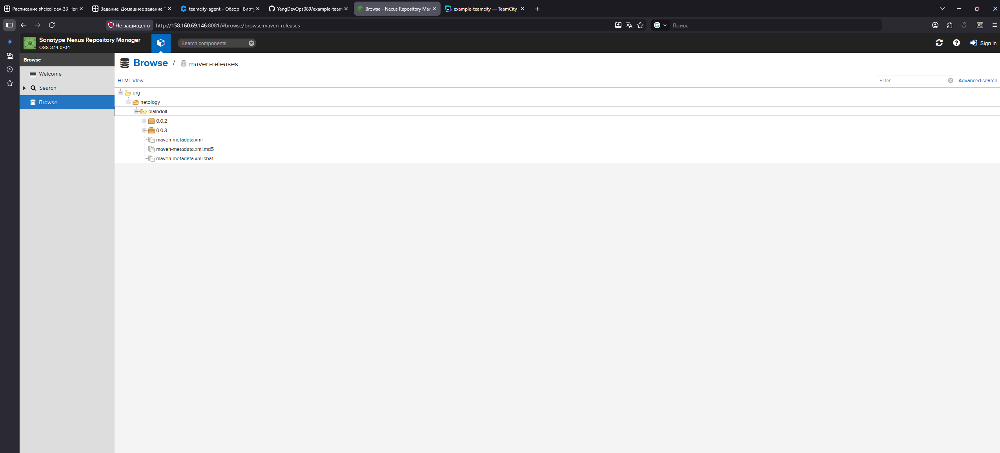
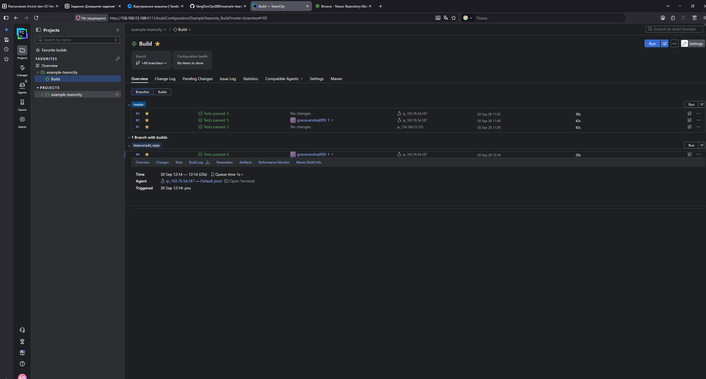
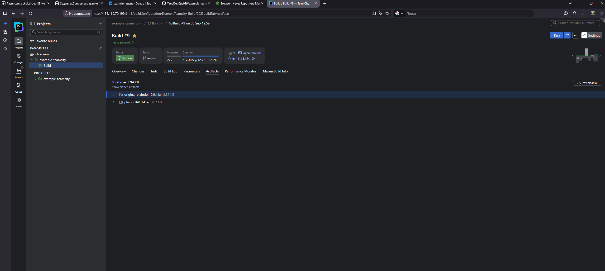

# Домашнее задание — TeamCity

Репозиторий: https://github.com/YangDevOps089/example-teamcity

Инфраструктура: teamcity-server, teamcity-agent, infra-vm (Nexus) на Yandex Cloud.

Три виртуалки в Yandex Cloud.

Два шага сборки — Maven (test) и Deploy, у каждого своё условие по ветке.

В шаге Deploy подключён settings.xml с кредами от Nexus.

pom.xml, поменял адрес Nexus в distributionManagement.

Артефакт после деплоя появился в Nexus.

Пришлось поднимать версию в pom.xml, т.к. Nexus не даёт передеплоить ту же версию в release-репозиторий.

Ветка feature/add_reply — добавил метод sayReply() в Welcomer и тест на него, все 6 тестов прошли.

После настройки artifact paths (target/*.jar) в сборке появился сам jar-файл.

Дальше смёржил feature/add_reply в master, всё собирается и деплоится нормально.
